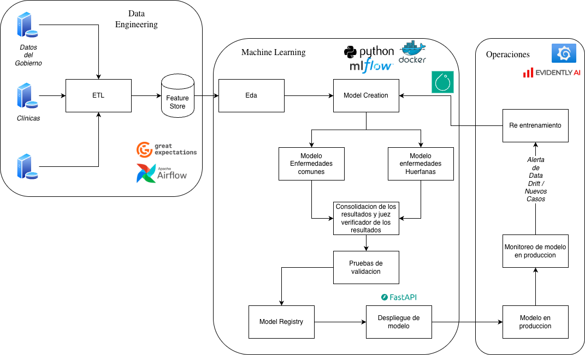

# Servicio de Evaluación Clínica — MLOps Taller 1

## punto 1
1. Diseño: Restricciones, Limitaciones y Datos
Restricciones y Limitaciones:

Desbalanceo de Clases Extremo: La principal limitación es la escasez de registros para enfermedades huérfanas frente a la abundancia de datos para enfermedades comunes. Entrenar un modelo único generaría un sesgo (bias) fuerte hacia la clase mayoritaria, produciendo falsos negativos críticos en diagnósticos de enfermedades raras.

Privacidad y Seguridad (Cumplimiento Normativo): Al tratar con información médica de pacientes, existen restricciones legales estrictas sobre la anonimización y el manejo de datos sensibles.

Frecuencia de Actualización: Las enfermedades huérfanas presentan nuevos casos con muy baja frecuencia, lo que dificulta establecer ventanas de re-entrenamiento periódicas estándar.

Tipos de Datos:

Se trabajará principalmente con datos tabulares extraídos de Historias Clínicas Electrónicas (EHR). Esto incluye variables continuas (temperatura, presión arterial), variables categóricas (síntomas presentados) y resultados numéricos de exámenes de laboratorio (ej. cuadros hemáticos, perfiles bioquímicos).

2. Desarrollo: Fuentes, Manejo de Datos y Modelado
Fuentes y Manejo de Datos (Pipeline ETL):

Fuentes: Integración de múltiples orígenes, como bases de datos gubernamentales de salud pública, registros internos de clínicas asociadas y, de ser necesario, datasets médicos anonimizados de consorcios de investigación.

Procesamiento: Es fundamental un pipeline robusto que realice la ingesta, limpieza e igualación de columnas. Esto implica normalizar la nomenclatura clínica, estandarizar las unidades de las variables y manejar los valores nulos para consolidar un Feature Store centralizado.

Estrategia de Modelado (Arquitectura Ensamble/Enrutador):
Dado el desafío del desbalanceo, se propone un enfoque de dos niveles:

Modelo de Detección de Anomalías / Enfermedades Huérfanas: Un modelo especializado en detectar patrones atípicos o entrenado con técnicas de Few-Shot Learning para las clases minoritarias.

Modelo de Clasificación Tradicional: Un modelo robusto para las enfermedades comunes.

Modelo Juez (Orquestador): Un modelo principal que evalúa las características de entrada y determina en cuál de los dos modelos especializados confiar más para la predicción final. Este desarrollo puede implementarse utilizando frameworks como PyTorch para una mayor flexibilidad en la arquitectura.

Validación y Pruebas:

Se realizará una división de datos utilizando muestreo estratificado (stratified split) para garantizar que las enfermedades huérfanas estén representadas tanto en train como en test.

Tras la validación offline con métricas como F1-Score (priorizando el Recall), se implementará un despliegue en modo Shadow en entornos clínicos reales. El modelo hará predicciones silenciosas para comparar su rendimiento con el criterio de los médicos antes de tomar decisiones activas.

3. Producción: Despliegue, Monitoreo y Retraining
Despliegue de la Solución:

La solución debe ser empaquetada en contenedores (ej. Docker) para garantizar la consistencia entre los entornos de desarrollo y producción.

Se expondrá mediante una API segura. La arquitectura debe contemplar Control de Acceso Basado en Roles (RBAC), ya que la interfaz y los permisos para consultar datos sensibles variarán drásticamente si el usuario final es un paciente desde su casa o un profesional de la salud en un entorno clínico.

Monitoreo (Observabilidad):

Métricas Operacionales: Uso de dashboards interactivos en herramientas como Grafana para monitorear la latencia, el uptime, el uso de CPU/RAM y la tasa de requests de la API.

Métricas de ML: Monitoreo continuo del Data Drift y Concept Drift. Se compararán estadísticamente las distribuciones de los datos de entrada en tiempo real frente a los datos de entrenamiento para detectar desviaciones.

Re-entrenamiento Continuo (CT):

El pipeline incluirá un flujo orquestado (por ejemplo, mediante DAGs en Airflow) que dispare un re-entrenamiento automático cuando se detecte un drift significativo o cuando se acumule un volumen predefinido de nuevos casos de enfermedades huérfanas, asegurando

### Diagrama del Pipeline



## Punto 2

Servicio contenerizado con **FastAPI** que permite evaluar el estado de salud de un paciente a partir de 5 signos vitales. Retorna una clasificación de riesgo: **Bajo riesgo**, **Riesgo moderado** o **Alto riesgo**.

## Parámetros del modelo

| Parámetro               | Tipo  | Descripción                        |
|--------------------------|-------|------------------------------------|
| `temperatura`            | float | Temperatura corporal en °C         |
| `presion_arterial`       | float | Presión arterial sistólica (mmHg)  |
| `frecuencia_cardiaca`    | int   | Frecuencia cardíaca (bpm)          |
| `frecuencia_respiratoria`| int   | Frecuencia respiratoria (rpm)      |
| `nivel_oxigeno`          | float | Saturación de oxígeno (% SpO2)     |

## Lógica de predicción

Cada parámetro se evalúa individualmente y suma puntos de riesgo (0, 1 o 2). La suma total determina la clasificación:

- **0–2 puntos** → Bajo riesgo
- **3–5 puntos** → Riesgo moderado
- **6+ puntos** → Alto riesgo

## 1. Construir la imagen de Docker

```bash
docker build -t mlopstaller1 .
```

## 2. Correr el contenedor

```bash
docker run -p 8000:8000 mlopstaller1
```

El servicio estará disponible en `http://localhost:8000`.

## 3. Obtener predicciones

### Opción A: Interfaz web

Abre `http://localhost:8000` en tu navegador. Ingresa los 5 signos vitales y presiona **Evaluar Paciente**.

### Opción B: API REST con `curl`

```bash
curl -X POST http://localhost:8000/api/predict \
  -H "Content-Type: application/json" \
  -d '{
    "temperatura": 39.0,
    "presion_arterial": 150,
    "frecuencia_cardiaca": 110,
    "frecuencia_respiratoria": 22,
    "nivel_oxigeno": 88.0
  }'
```

Respuesta esperada:

```json
{"resultado": "Alto riesgo"}
```

## Tecnologías

- Python 3.12
- FastAPI + Uvicorn
- Jinja2 (templates HTML)
- Docker